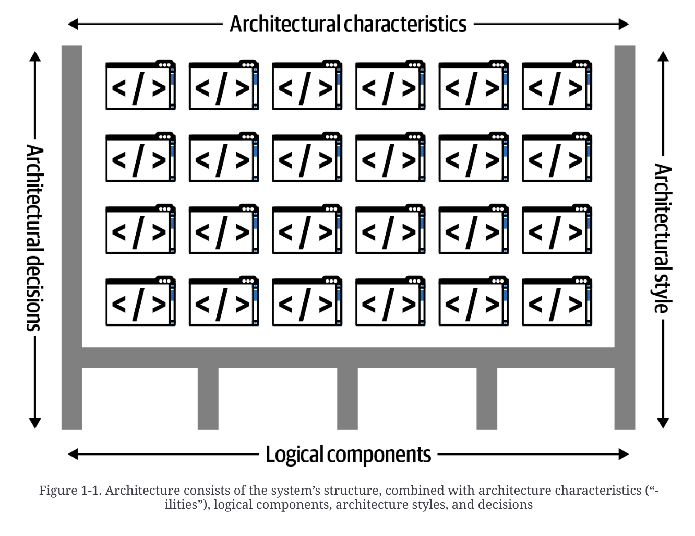
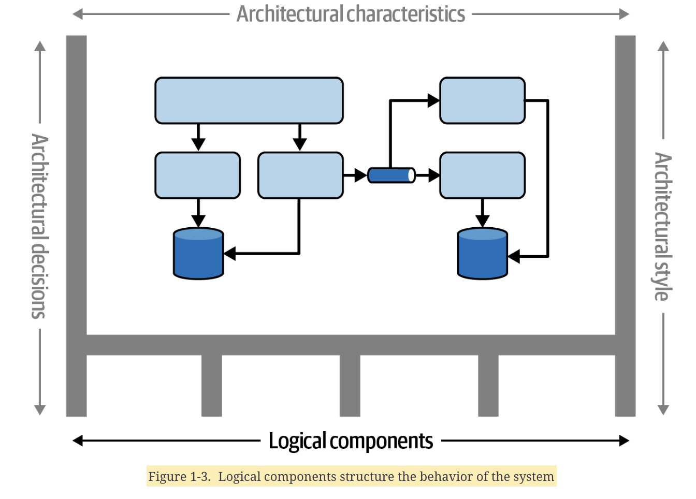
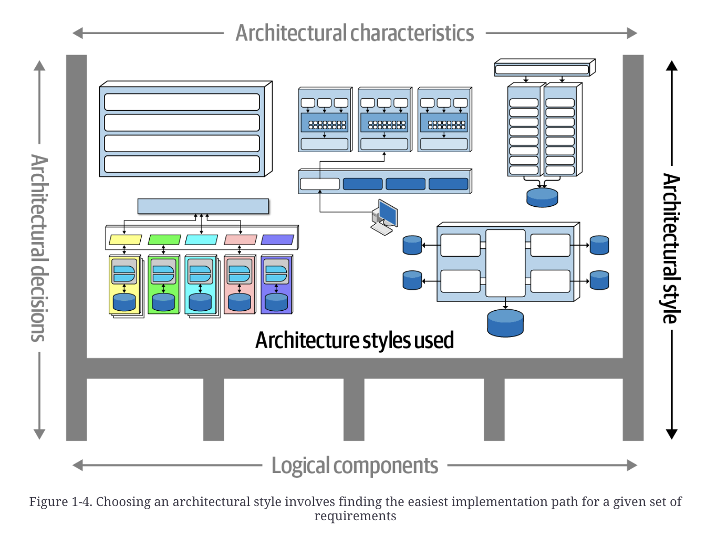
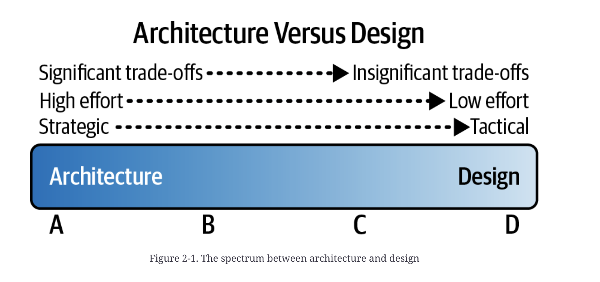
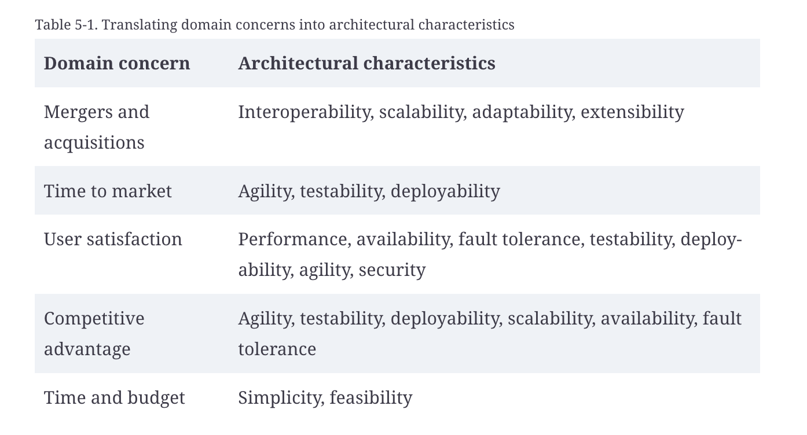
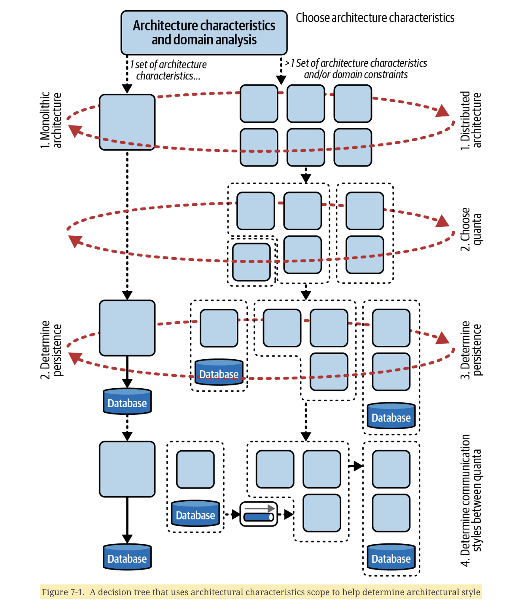

# fundamentals-of-software-architecture-2nd-edition

## Chapter 1 - Introduction

### Defining Software Architecture

- 4 dimensions
- Software architecture of a system consists of an `architecture style` as the starting point, combined with the `architecture characteristics` it must support, the `logical components` to implement its behavior, and finally the `architecture decisions` to justify it

- `Architecture characteristics` define the `capabilities` of a system (aka the `-ilities`) and the criteria for success
    - Availability, reliability, testability, scalability, security, agility, fault tolerance, elasticity, recoverability, performance, deployability, learnability...
- `Logical components` define its *behavior*
    - **Defining these logical components is one of the key structural activities for architects**

- One required architectural characteristics are identified and the logical components needed, you can use this as a starting point to choose an appropriate `architecture style` for implementing the solution
    - **This is what is needed to choose the appropriate architectural style**

- The fourth dimension is `architectural decisions`, which define the rules for how a system should be constructed

### Laws of Software Architecture

- Law 1: Everything in software architecture is a trade-off
    - If you think you've identified something that isn't a trade-off, you haven't identified the trade-off yet
    - Trade-off analysis is an ongoing activity
        - There is no one size fits all solution for all systems
        - Every situation requires us to re-evaluate those trade-offs
- Law 2: Why is more important than how
    - Architecture is broader than just a combinatin of structure elements
- Law 3: Software architecture decisions aren't binary but rather exist on a spectrum between extremes
    - Why an architect made an particular decision includes the trade-offs they considered
    - Seeing an architecture you may be able to understand *how* it works, but might struggle with *why* the previous architect or team made certain decisions

### Expectations of a an Architect
- Make architecture decisions
- Continually analyze the architecture
- Keep current with latest trends
- Ensure compliance with decisions
- Understand diverse technologies, frameworks, platforms, and environments
- Lead a team and possess interpersonal skills
- Understand and navigate organizational politics
    - Almost every decisions an architect makes will be challenged
        - Must justify those decisions

## Chapter 2 - Architectural Thinking

- Image helping decide if something is architectural or design
    - These things are usually on a spectrum

- Technical breadth becomes more important than technical depth
    - Some areas you will specialize in either out of need or out of interest
- Thinking like an architect means analyzing trade-offs then asking questions like "which is more important: extensibility or security"

### Understanding Business Drivers

- Thinking like an architect also means understanding the business drivers required for the success of the system and translating those requirements into architecture characteristics

## Chapter 3 - Modularity

- `Modularity` is an organizing principle
- Preservering good modularity is a good example of an implicit architectural characteristic: project requirements don't ask for this but it's required if you wan ta sustainable code base

### Modularity Versus Granularity

- Modularity is about breaking systems apart into smaller pieces - such as moving from a monolithic architecture to a high distributed architecture (like microservices)
- Granularity is about the size of those pieces - how big a particular part of the system should be

### Defining Modularity

- `Modularity` is a **logical** grouping of related code
    - Classes in OO language
    - Group of functions in structured or functional language
- Use modules as a way to group related code together - `com.mycompany.customer` package in Java should contain things related to customers
- Modularity doesn't imply physical separation, just logical

### Measuring Modularity

#### Cohesion

- Extent to which a module's parts hould be contained within the same module
    - Measures how related the parts are to one another
    - Ideal cohesive module is where all parts are packaged together; breaking them into smaller pieces would require coupling the parts together via calls between modules to achieve useful results
- Cohesion is a range - below is a least as measured from best to work
    - Functional cohesion
    - Sequential cohesion
    - Communicational cohesion
    - Procedural cohesion
    - Temporal cohesion
    - Logical cohesion
        - Code within modules is related logically but not functionally 
        - Common example is `StringUtils` - a group of static methods that operate on `String` but are otherwise unrelated

## Chapter 4 - Architectural Characteristics Defined

- `Structural design` is one of the key activites for software architects 
    - Two sub-activities (performed in any other or in parallel):
        - Architectural characteristics analysis
        - Logical component design
    - Can be performed in any order (or even in parallel)
- `Problem domain` aka `domain` is the list of requirements required to solve some problem
- Software solution consists of both domain requirements and architectural characteristics
- Architects help define the domain but must also define/discover/analyze the things the software must do that aren't directly related to the domain functionality - these *things* are `architectural characteristics`
- **Architectural characteristics vs behavior**
    - Architectural characteristics are referred to as the `capabilities` of the system
    - The domain represents the system's `behavior`

### Architectural Characteristics and System Design

- To be considered an architectural characteristic, a requirement must meet 3 criteria
    - Specify a *nondomain* design consideration
    - Influence some structural aspect of the design
    - Be critical or important to the application's succes
- *Nondomain design consideration*
    - Structural design in software architecture consists of two activities by an architect
        - Understanding the problem domain
        - Uncovering what kinds of "-ilities" the system needs to support to be successful
    - Domain design considerations cover behavior of the system and architectural characteristics define the "-ilities" (aka capabilities)
    - Design requirements specify WHAT the application should do
    - Architectural characteristics specify HOW to implement the requirements and WHY certain choices were made
    - For example, performance may be an important architectural characteristic, but often don't appear in requirements documents
- *An architecture characteristic influences some structural aspect of the design*
    - Primary reason architects try to describe architectural characteristics is to tease out important design considerations
        - Can the architect implement it via design or does this architectural characteristics require special structural consideration to succeed
    - Consider scalability, no amount of clever design will allow a monolithic architecture to scale beyond a certain point - system must change to a distributed architectural style
    - Architects often pay close attention to operational architectural characteristics because they are the characteristics that most often require special structural support
- *An architecture characteristic must be critical or important to application success*

 

- Implicit vs explicit architectural characteristics
    - Implicit ones rarely appear in requirements yet they're necessary for the project to succeed (think availability, reliability, and security)
        - Architects must use knowledge of problem domain to uncover these - for example, a stock trading platform requires low latency for fast trades
    - Explicit characteristics appear in requirements documents or some other specific instructions

### Architectural Characteristics (Partially) Listed

- Architectural characteristics exist a broad spectrum ranging from low-level code characteristics (such as modularity) to sophisticated operational concerns (such as scalability and elasticity)

#### Operational Architectural Characteristics

- Availability
    - Up time of system
- Continuity
- Performance
    - How well system performs - response times is a common way to do this
- Recoverability
- Reliability
    - Does system need to be fail safe? Is it mission critical? If it fails will it cost the company large sums of money?
- Robustness
- Scalability
    - System's ability to perform and operate as the number of users or requests increases

#### Structural Architectural Characteristics

- Configurability
    - How easily end users can change aspects of the software's configuration through interfaces
- Extensibility
    - How well the architecture accomodates changes that extend its existing functionality
- Installability
- Leverability/reuse
    - Extent to which system's common components can be leveraged across multiple products
- Localization
- Maintainability
    - How easy it is to apply changes and enhance the system
- Portability
- Upgradeability

#### Cloud Characteristics

- On-demand scalability
- On-demand elasticity
- Zone-based availability
- Region-based privacy and security

#### Cross-Cutting Architectural Concerns

- Accessibility
- Archivability
- Authentication
- Authorization
- Legal
- Privacy
- Security
- Supportability
- Usability

### Trade-Offs and Least Worst Architecture

- Architects should only support those architectural characteristics that are critical to the system's success
- Supporting architectural characteristics is expensive
    - Each architectural characteristic requires design effort from the architect and effort from devs to implement and maintain it
    - Architectural characteristics interact with each other - for example, improving security can negatively impact performance
    - Usually there are trade-offs between competing concerns

## Chapter 5 - Identifying Architectural Characteristics

- To create an architecture or determine the validity of an existing architecture, architects must analyze two things
    - Architectural characteristics
    - Domain
- Identifying the correct architectural characteristics for a given problem or application requires not only understanding the domain problem but also collaborating with stakeholders to determine what is truly important from a domain perspective
- At least 3 places to uncover architectural characteristics a project needs
    - Domain concerns
    - Project requirements
    - Implicit domain knowledge
- Some domains include implicit architectural characteristics
    - An architect working on medical software that reads from diagnostics equipment should already understand the importance of data integrity and potential consequence of losing messages
        - Architects who work in that domain internalize data integrity, so it becomes implicit in every solution they design

### Extracting Architectural Characteristics from Domain Concerns

- Most architectural characteristics come from listening to key domain stakeholders and collaborating with them to determine what is important forom a business perspective
    - Architects and domain stakeholders speak different languages
        - Scalability/Availability/Learnability/etc vs Mergers & Acquisitions/User Satisfaction/Time to market/etc

### Composite Architectural Characteristics

- Common pitfall is making false equivalences when translating domain concerns into architectural characteristics
    - Like equating agility soley with time to market
    - Agility is not one thing (there's no measure for it)
        - Agility is composed of deployability, modularity, and testability
- Common anti-pattern arises when architects focus narrowly on just one part of a composite
    - Like focusing on performance but not accounting for the availability is required (doesn't matter how fast the system is if it isn't up, ofr example)

### Extracting Architectural Concerns

- Most architectural characteristics come from explicit statements in some form of requirements document
    - Explict number of expected users and scale
    - Keep the domain always in mind
        - Imagine you're designing an application that handles class registration for university students - it's very likely a large number of those students wait until the last moment to sign up

### Implicit Characteristics

- Availability/stability/security are examples of common implicit architectural characteristics
- *Do not stresss too much about discovering the exactly correct set of architectural characteristics*
    - Developers can implement functionality in a variety of ways - for example, you could design an architecture that doesn't support customizability structurally, instead requiring the application itself to support that behavior
- Once first pass is made at identifying architectural characteristics, try to determine the least important one
    - If you had to elimiate one, what would it be?

## Chapter 7 - The Scope of Architectural Characteristics

- Many modern architectures, like microservices, contain different architecture characteristics at the service and system levels

### Architectural Quanta and Granularity

- Many business concepts bind parts of the system together sematically, creating *functional cohesion*
- **An architecture quantum establishes the scope for a set of architectural characteristics** - it features:
    - Independent deployment from other parts of the architecture
    - High functional cohesion
    - Low external implementation static couplin
    - Synchronous communication with other quanta
- *Establishes the scope for a set of architectural characteristics*
    - Architects use the architecture quantum as a boundary for delineating a set of architectural characteristics, usually operational ones
- *Independently deployable*
    - An architecture quantum includes all the necessary components to function independently from other parts 
    - For example, if an application uses a databsae, the db is part of the quantum, because the system won't function without it
    - In the microservices architecture, each service has its own db which creates multiple quanta within a single architecture
- *High functional cohesion*
    - *Cohesion* in component design refers to how unified the contained is in its purpose
    - High functional cohesion implies that an architecture quantum does something purposeful
    - In distributed architectures like event-driven or microservices, architects are more likely to design each service to match a single workflow, so that service would exhibit high functional cohesion
- Following are different types of coupling
    - *Semantic coupling*
        - Natural coupling of the problem for which an architect is building a solution
        - An order processing application's semantic coupling includes things like inventory, item catalog, shopping carts, customers, and sales
    - *Implementation coupling*
        - Describes how an architect and team decide to implement particular dependencies
        - In an order processing application, team must consider variety of constrains in setting domain boundaries
            - Should all data reside in single db?
            - Does a monolith or distributed architecture make sense
            - Answer these these questions have little effect on system's semantic coupling but greatly affect architectural decisions
    - *Static coupling*
        - Refers to "wiring" of architecture - how seervices depend on each other
        - 2 services are part of the same architecture quantum if they both depend on the same coupling point
        - For example, microservices `Catalog` and `Shipping` need to share address information, so they both create a dependency to a shared component
            - Because both services are coupled to that dependency, they are part of the same architecture quantum
    - *Dynamic coupling*
        - Describes forces involved when architectural quanta must communicate with each other
        - For example, when two services are runnings, they must communicate to form workflows and perform tasks in the system 
- *Low external implementation static coupling*
    - Characteristic dervied from the DDD philosophy of low coupling between bounded contexts
    - COME BACK TO THIS, STILL DON'T UNDERSTAND

### Impact of Scoping

- *Architects can use the scope of architectural characteristics to help determine appropriate service boundaries*

