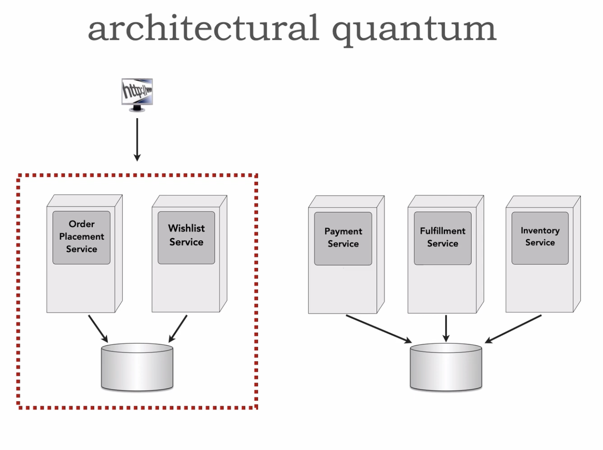
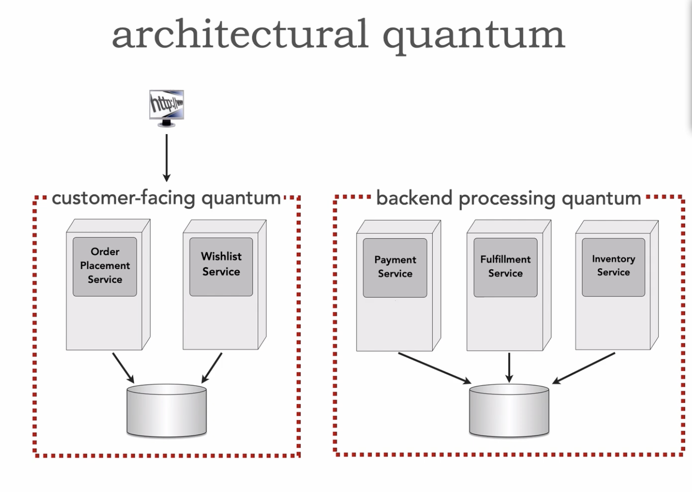
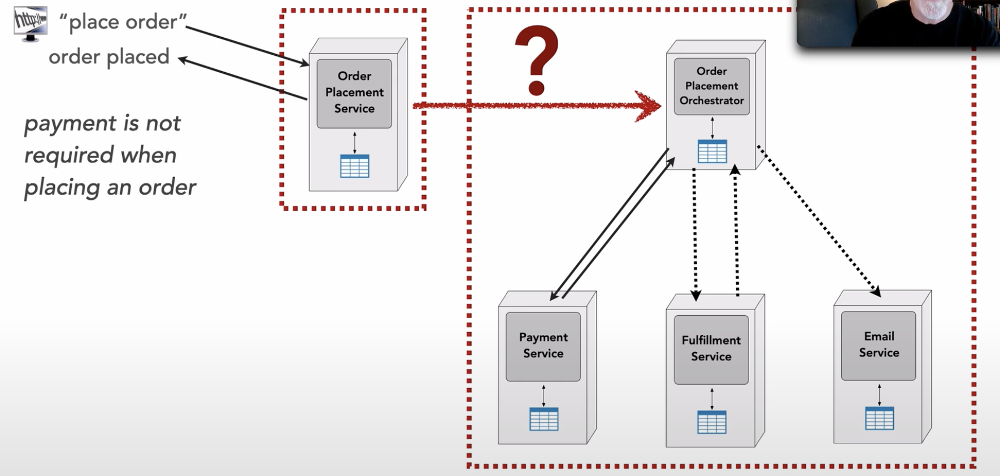
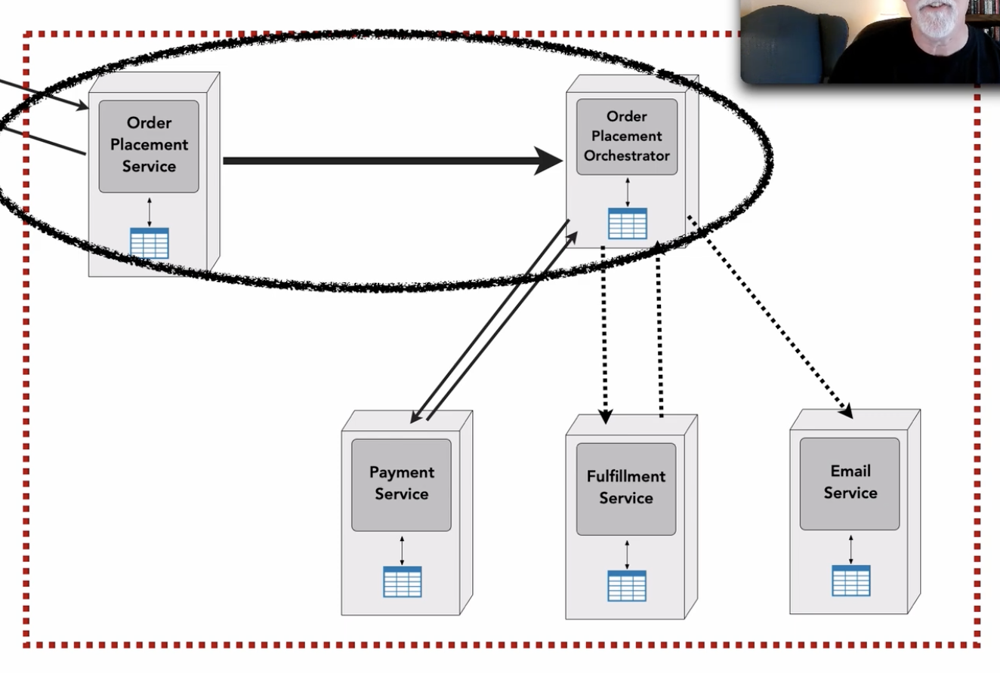
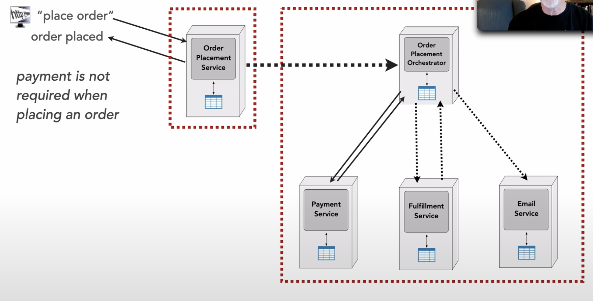
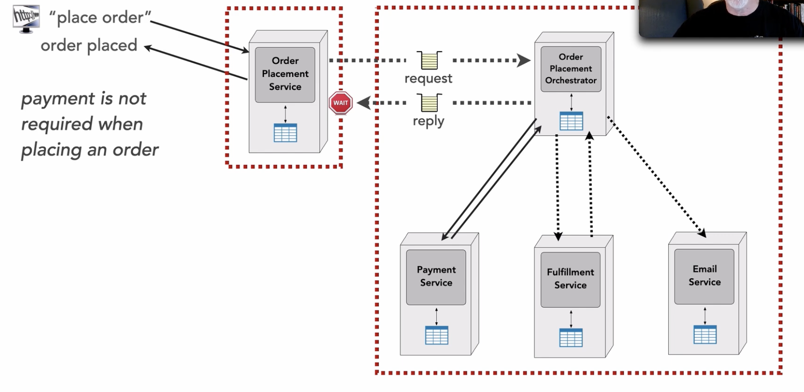
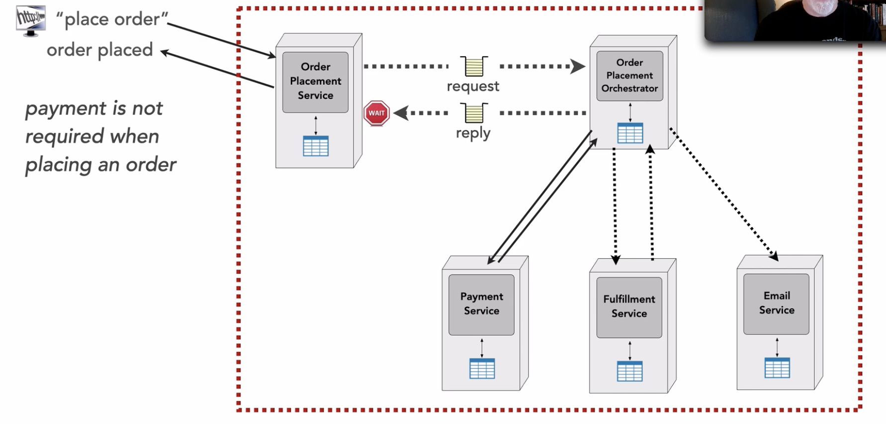

# Dynamic Quantum Entanglement

## Link

- https://www.developertoarchitect.com/lessons/lesson138.html

## Details

- `Architectural quantum` - an independently deployable artifact with high functional cohesion and synchronous dynamic coupling
    - `Quantum` here meaning smallest thing that can stand alone in an architecture
    - *Dynamic coupling* describes the forces involved when architecture quanta must communicate with each other
        - For example, when two services are running, they must communicate to form workflows and perform tasks within the system
- Architecture characteristics live at the quantum level

- Example

- This part of system is separately deployable (user interface, services, data)
    - *Functional cohesion is that it's all user facing*

- These other parts are just backend processing

 

- `Dynamic` part means how different things are being called or calling

- In the above example, we have two architectural quantam
    - These two likely have very different architectural characteristics
    - On right side, we have some sync and async communication
- How does the order placement service communicate with the order placement orchestrator - sync or async?
- If this is sync, it makes the entire thing one quantum

- **If this is one quantua, everything needs to support the same architectural characteristics**
    - This comes back to the definition, *synchronous dynamic coupling*
    - When you communicate synchronously with any kind of service in another architectural quantum, you are effectively `entagling` those and force to have same architectural characteristics

 

- If you use async communication, these quanta are kept separately

 

- What about request/reply messaging?
    - Async request
    - Async reply

- If order placement service needs this response, then it's still apart of one single quantum, they are still entangled
    - Order placement service still needs to wait

