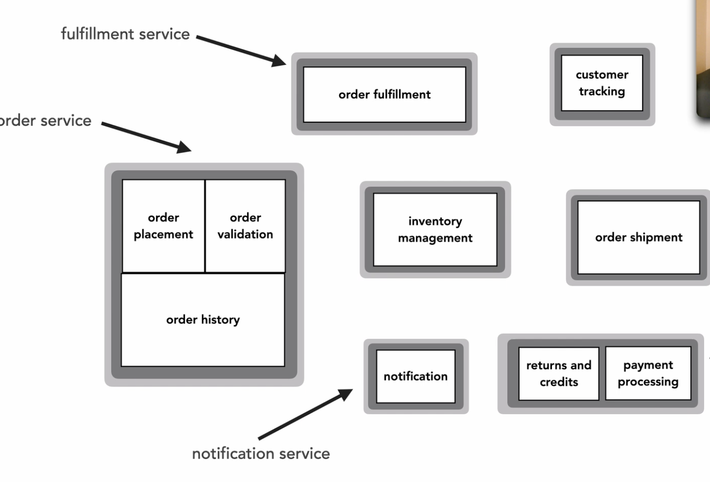
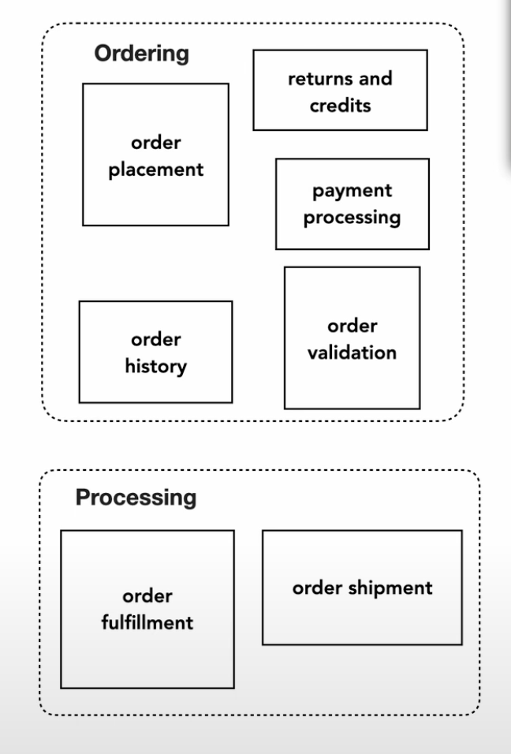
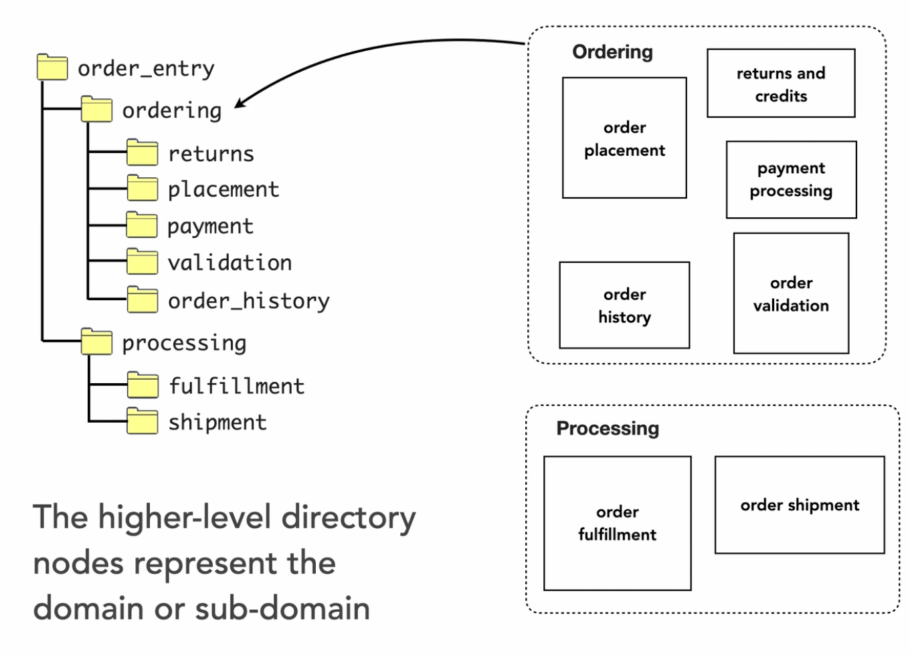
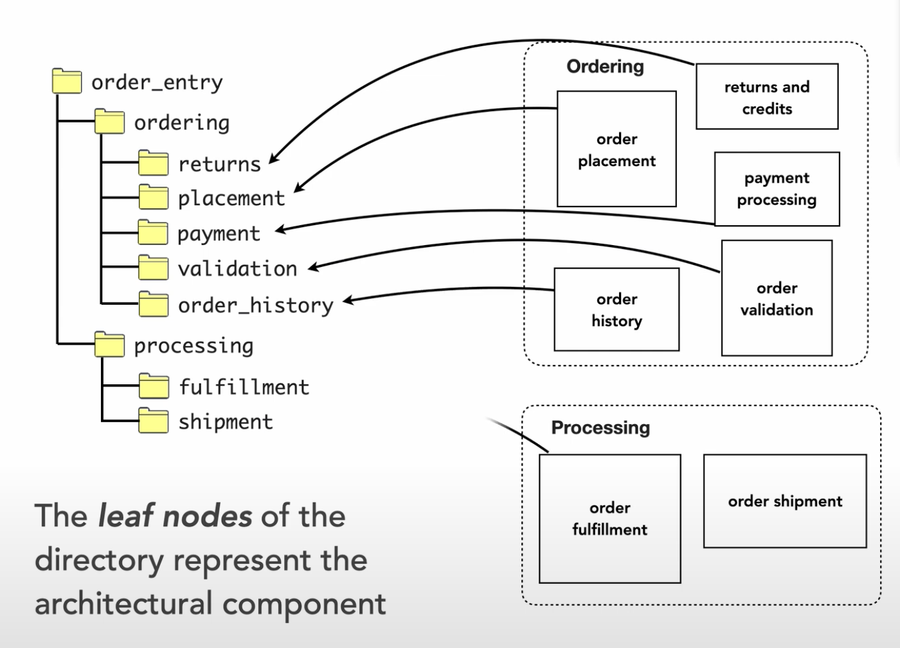

# Logical Architecture Components

## Link

- https://developertoarchitect.com/lessons/lesson177.html

## Details

- A `logical architecture component` is a building block of the overall system
    - Similar to how rooms in a floor plan are building blocks of that house
- These building blocks can be put together as a monolithic application
- They can also be used to create services

- Note it's not always a 1:1 in a distributed architecture
    - Order service contains 3 components - order placement, order validation, and order history
- A lot of time spent on how these logical components fit together
- These logical components can be grouped into domains

- Namespaces or directory structure is organized can reflect logical architecture

- `Leaf nodes` represent the logical component

- Logical architecture is different from a physical architecture