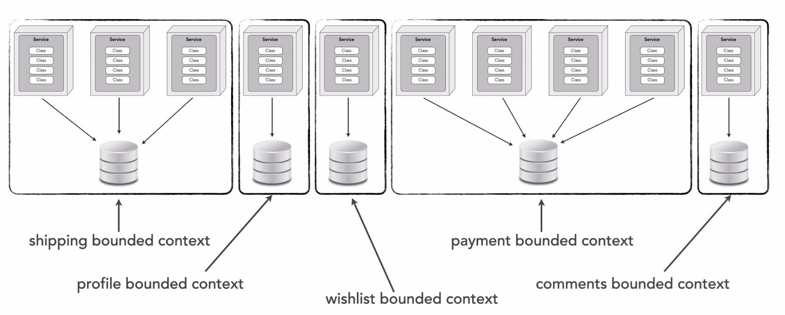
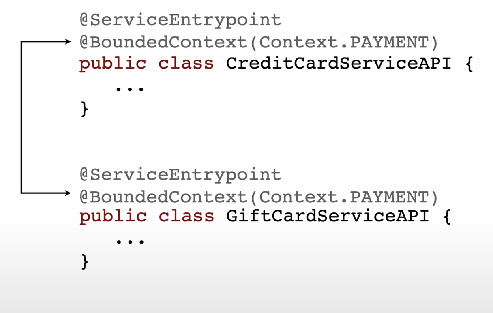
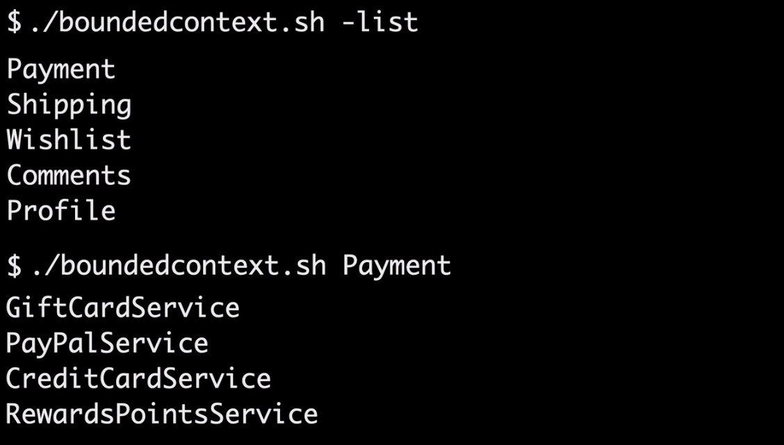

# Managing Broad Bounded Context

## Link

- https://developertoarchitect.com/lessons/lesson125.html

## Details

- database-per-service pattern
- Bounded context includes functionality and database
- Control of data is maintained because only 1 service maintains the data
- Usually we actually end up in a `data domain pattern`
    - There are legitimate reasons where multiple services must use the same data and data is shared

- Shipping pattern context is a `broad bounded context`
- To ensure we can properly identify all the services using that data, we can use an annotation
    - Can tag the bounded context the service is in programatically

- In this example `CreditCardServiceAPI` and `GiftCardServiceAPI` are 2 classes in the same application
- Having this annotation tells what me what classes are apart of the `PAYMENT` bounded context and what I may need to retest
- Can write CLIs or other tools to find these bounded

