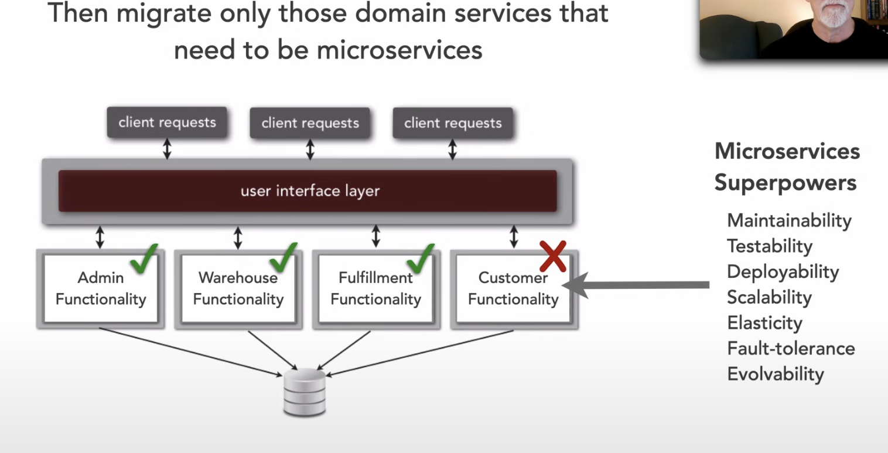

https://developertoarchitect.com/lessons/lesson214.html

- There are things within a system that do not require microservice benefits, and if they don't benefit, but you still set it up that way then you incur all the cost of that pattern as well

- A good starting point is to take a monolith and built coarse grain domain services too before deciding if things need to be broken down further

- This is much easier to start with because you don't need to worry about breaking up the data (still use same database)
- Once you identify a domain service that should be microservices, then you can move that
- Not every portion of a system needs to be microservices