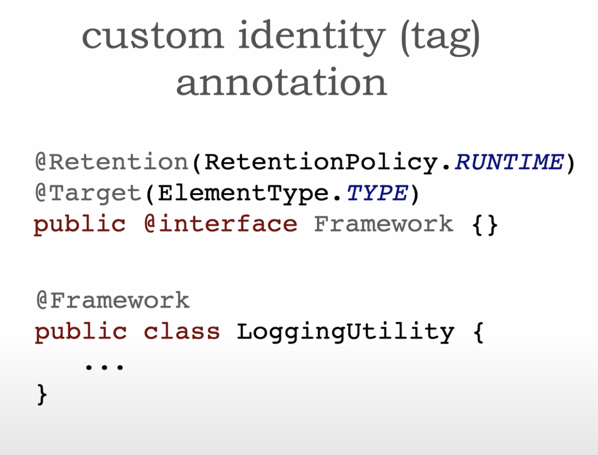

# Microservices Annotations and Attributes

## Link

- https://developertoarchitect.com/lessons/lesson107.html

## Details

- Programmatic metadata

- Service entrypoint annotation
- Service type
    - Orchestration service, infrastructure service, functional service, etc...
- These annotations give context to developers/architects on what the microservice does