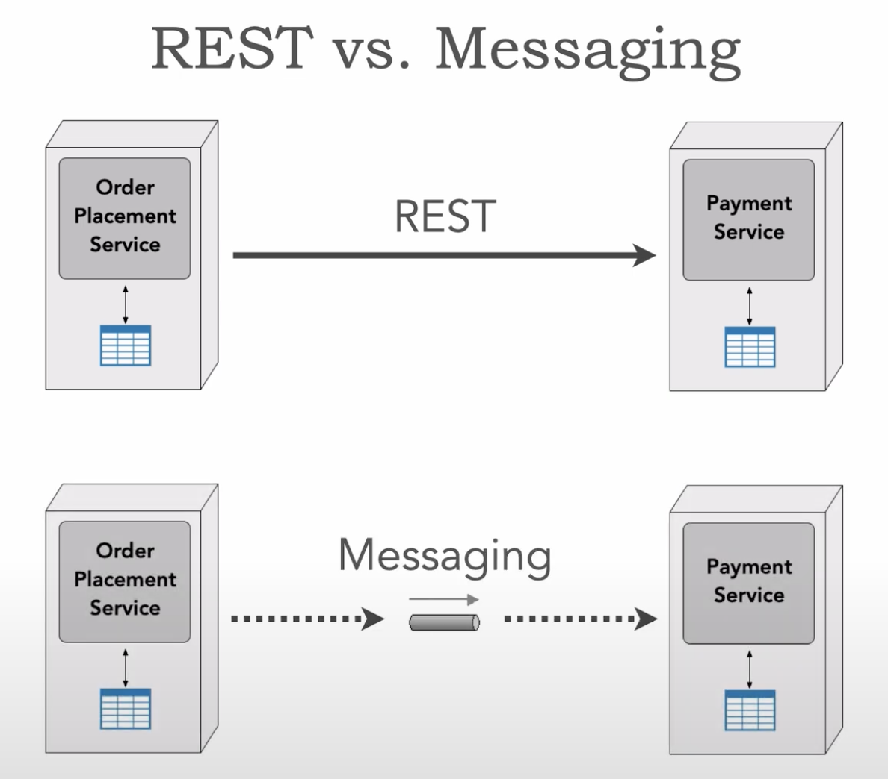
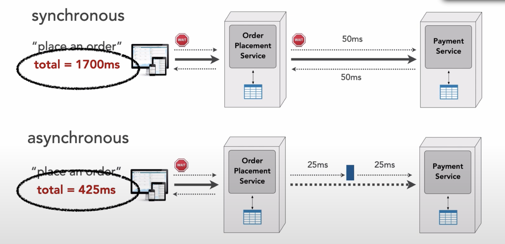
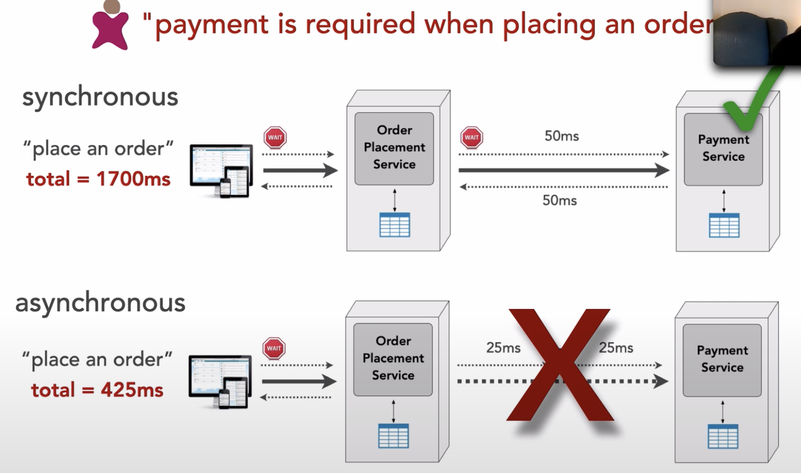

# Rest vs Messaging (sync vs async)

## Link

- https://developertoarchitect.com/lessons/lesson137.html

## Details

- Real question is whether you need sync or async

- Async is a great benefit from performance perspective and responsive perspective
- If payment service becomes unavailable, with sync approach, we can't satisfy request
- With async request, we can still place orders

 

- On the other hand, with sync, we know that payment has already been applied
    - Know all parts of request have been completed
- With async, payment will be applied eventually

 

- Other scenario
- What if credit card is expired?
- **Error handling is much easier in sync scenario**

- If product owner says something like `payment is required when placing an order`, we must use sync
- So sync vs async may be business rule driven

 

- He has an interesting perspective on the later part of his video...
    - He suggestions using public APIs for requests coming from UIs (or probably backend for frontends, BFFs, as well)
    - Suggested using request/reply messaging for inter-service communication to create a sort of private API
        - Public API may have much more information than needed - bandwidth concerns, stamp coupling, etc
        - Why not use GraphQL and people can ask for what they what?
        